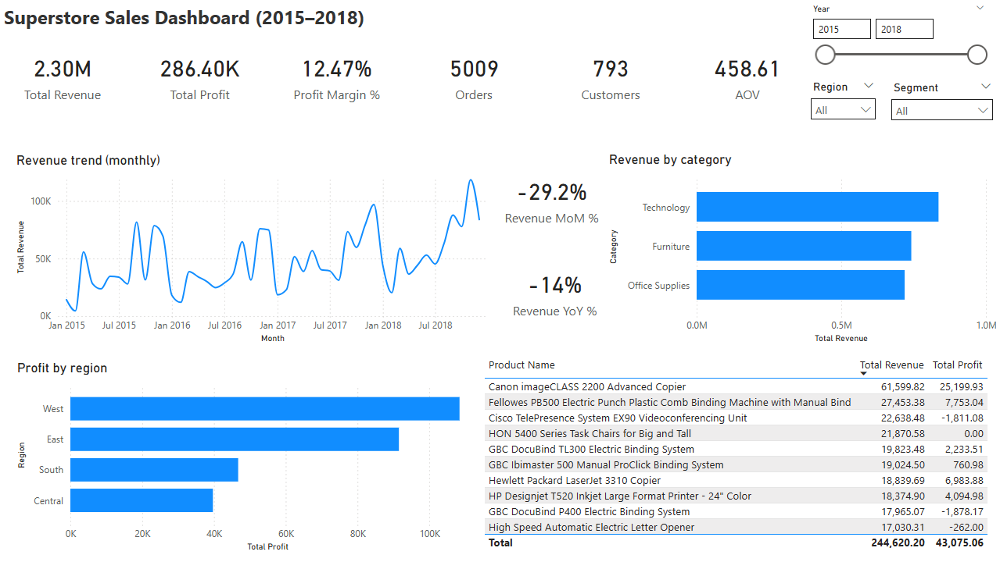

# Superstore Sales Dashboard (Power BI)

Interactive Power BI dashboard analysing Superstore sales performance (2015–2018).

## Dashboard Preview

## What this shows
- Monthly revenue trend
- Revenue by category
- Profit by region
- Top 10 products by revenue
- KPI cards: Revenue, Profit, Margin %, Orders, Customers, AOV
- Latest-month MoM% and YoY% revenue change

## Dataset
- Superstore sales data (CSV) in `data/`

## How to use
1. Download `report/sales-powerbi-dashboard.pbix`
2. Open in Power BI Desktop
3. If prompted, point the data source to `data/superstore.csv`

Key DAX measures are documented in `dax/MEASURES.md`.
